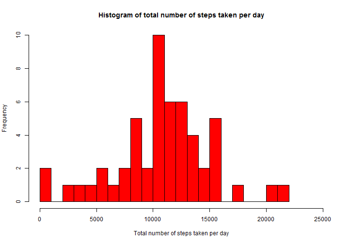
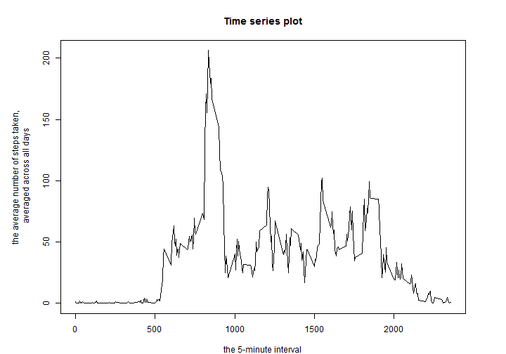
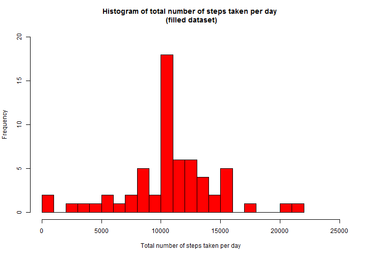
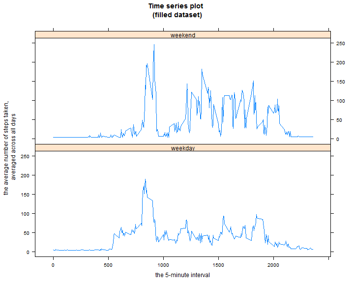

# Loading and settings
At first, we need to load required libraries.

```r
library(knitr)
library(lattice)
```

Then, we need to prepare a directory for figures.

```r
if (!file.exists("figure")) {
      dir.create("figure")
}
```


# Analysis
The data for this assignment can be downloaded from [here](https://d396qusza40orc.cloudfront.net/repdata%2Fdata%2Factivity.zip)


## 1. Loading and preprocessing the data
Show any code that is needed to

1. Load the data (i.e. read.csv())
2. Process/transform the data (if necessary) into a format suitable for your analysis

```r
# loading data
unzip("repdata-data-activity.zip")
data <- read.csv("activity.csv")
```

The variables included in this dataset are:

- **steps**: Number of steps taking in a 5-minute interval (missing values are coded as `NA`)
- **date**: The date on which the measurement was taken in YYYY-MM-DD format
- **interval**: Identifier for the 5-minute interval in which measurement was taken

The dataset is stored in a CSV file and there are a total of 17568 observations in the dataset.


## 2. What is mean total number of steps taken per day?
For this part of the assignment, you can ignore the missing values in the dataset.

1. Calculate the total number of steps taken per day
2. If you do not understand the difference between a histogram and a barplot, research the difference between them. Make a histogram of the total number of steps taken each day
3. Calculate and report the mean and median of the total number of steps taken per day

```r
# calculating total number of steps per day
table1 <- aggregate(formula = steps ~ date, data = data, FUN = sum)

# making a histogram
hist(x = table1$steps, 
     breaks = 20, 
     main = "Histogram of total number of steps taken per day", 
     xlab = "Total number of steps taken per day", 
     xlim = c(0, 25000),
     col = "red")
```

 

```r
# calculating mean and median
summary(table1$steps, digits = 7)[4:3]
```

```
##     Mean   Median 
## 10766.19 10765.00
```


## 3. What is the average daily activity pattern?
1. Make a time series plot (i.e. `type = "l"`) of the 5-minute interval (x-axis) and the average number of steps taken, averaged across all days (y-axis)
2. Which 5-minute interval, on average across all the days in the dataset, contains the maximum number of steps?

```r
# calculating average number of steps per day
table2 <- aggregate(formula = steps ~ interval, data = data, FUN = mean)

# making a plot
par(mar = c(4,6,4,4))
plot(x = table2$interval, 
     y = table2$steps,
     type = "l",
     main = "Time series plot",
     xlab = "the 5-minute interval",
     ylab = "the average number of steps taken, \n averaged across all days")
```

 

```r
# identifying of interval, which contains the maximum
row <- which(table2$steps == max(table2$steps))
table2[row,]
```

```
##     interval    steps
## 104      835 206.1698
```


## 4. Imputing missing values
Note that there are a number of days/intervals where there are missing values (coded as `NA`). The presence of missing days may introduce bias into some calculations or summaries of the data.

1. Calculate and report the total number of missing values in the dataset (i.e. the total number of rows with NAs)
2. Devise a strategy for filling in all of the missing values in the dataset. The strategy does not need to be sophisticated. For example, you could use the mean/median for that day, or the mean for that 5-minute interval, etc.
3. Create a new dataset that is equal to the original dataset but with the missing data filled in.
4. Make a histogram of the total number of steps taken each day and Calculate and report the mean and median total number of steps taken per day. Do these values differ from the estimates from the first part of the assignment? What is the impact of imputing missing data on the estimates of the total daily number of steps?

```r
# calculating total number of missing values
nrow(data[!complete.cases(data$steps),])
```

```
## [1] 2304
```

```r
# strategy for filling in all of the missing values
fit <- lm(data, formula = steps ~ interval)

# new dataset with the missing data filled in
filled_data <- data
for (i in 1:nrow(filled_data)) {
      if (is.na(filled_data$steps[i])) {
            filled_data$steps[i] <- fit$coefficients[[2]]*filled_data$interval[i] + fit$coefficients[[1]]
      }
}

# making a histogram, calculating mean and median
table3 <- aggregate(formula = steps ~ date, data = filled_data, FUN = sum)

hist(x = table3$steps, 
     breaks = 20, 
     main = "Histogram of total number of steps taken per day \n (filled dataset)", 
     xlab = "Total number of steps taken per day", 
     xlim = c(0, 25000),
     ylim = c(0, 20),
     col = "red")
```

 

```r
summary(table3$steps, digits = 7)[4:3]
```

```
##     Mean   Median 
## 10766.19 10766.19
```
Filled in missing values do differ from the estimates from the first part of the assignment just a bit.

|original data  | mean                                     |     median                              |   
|:--------------|:----------------------------------------:|----------------------------------------:|
|original data  | 1.076619 &times; 10<sup>4</sup> | 1.0765 &times; 10<sup>4</sup>|
|filled data    | 1.076619 &times; 10<sup>4</sup> | 1.076619 &times; 10<sup>4</sup>|

Mean and median depends on how you filled in all of the missing values. Since I used regression model, there was practically no difference because we basically pulled the averages closer to calculated average value by regression model.

NOTE: For filling in all of the missing values was used linear regression model.

```r
summary(fit)
```

```
## 
## Call:
## lm(formula = steps ~ interval, data = data)
## 
## Residuals:
##    Min     1Q Median     3Q    Max 
## -45.21 -39.59 -33.14 -25.95 772.36 
## 
## Coefficients:
##              Estimate Std. Error t value Pr(>|t|)    
## (Intercept) 29.553871   1.786848  16.540  < 2e-16 ***
## interval     0.006649   0.001308   5.083 3.76e-07 ***
## ---
## Signif. codes:  0 '***' 0.001 '**' 0.01 '*' 0.05 '.' 0.1 ' ' 1
## 
## Residual standard error: 111.9 on 15262 degrees of freedom
##   (2304 observations deleted due to missingness)
## Multiple R-squared:  0.00169,	Adjusted R-squared:  0.001624 
## F-statistic: 25.83 on 1 and 15262 DF,  p-value: 3.765e-07
```


## 5. Are there differences in activity patterns between weekdays and weekends?
For this part the weekdays() function may be of some help here. Use the dataset with the filled-in missing values for this part.

1. Create a new factor variable in the dataset with two levels – “weekday” and “weekend” indicating whether a given date is a weekday or weekend day.
2. Make a panel plot containing a time series plot (i.e. type = "l") of the 5-minute interval (x-axis) and the average number of steps taken, averaged across all weekday days or weekend days (y-axis). See the README file in the GitHub repository to see an example of what this plot should look like using simulated data.

```r
# weekends or weekdays
filled_data$day <- weekdays(as.Date(filled_data$date))

saturday <- grep("saturdaya", filled_data$day)
sunday <- grep("sunday", filled_data$day)
weekends <- c(saturday, sunday)

filled_data$week <- "weekday"
filled_data$week[weekends] <- "weekend"

filled_data$week <- factor(filled_data$week)

# making a plot
table4 <- aggregate(formula = steps ~ interval + week, data = filled_data, FUN = mean)

par(mar = c(4,6,4,4))
xyplot(steps ~ interval | week,
       table4,
       type = "l",
       layout = c(1,2),
       main = "Time series plot \n (filled dataset)",
       xlab = "the 5-minute interval",
       ylab = "the average number of steps taken, \n averaged across all days")
```

 
